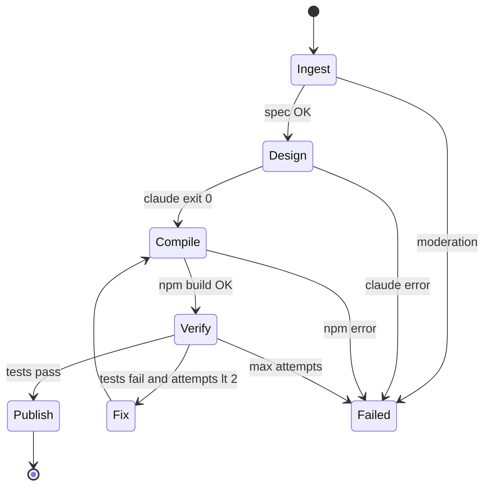

# BEXO — Claude Code Orchestrator & Million-User Scale

**Your situation today:** GCP secrets, n8n webhooks, Supabase, GCS, and Cloudflare are working. The **main remaining shift** is replacing the in-process Python HTML loop with a **proper Claude Code orchestrator** that can run reliably under load.

This document is the fundamentals plan — not a repeat of infra setup (see `GCP-CLAUDE-SETUP-GUIDE.html`).

---

## 1. What is already done (keep it)

| Layer | Status | Scales how |
|-------|--------|------------|
| Supabase = source of truth | Done | Postgres scales with Supabase plan |
| 90% profile gate (app + API) | Done | Cheap checks only |
| `data.json` sync on edit | Done (`sync-data`) | **Millions of edits** — GCS write, no AI |
| n8n Workflow A → `/build` | Working | Becomes **enqueue** later |
| n8n Workflow B → KV + `done` | Working | Keep |
| Cloudflare Worker → GCS | Working | Edge scales globally |
| `spec_builder.py` (DB → portfolio.md) | Done | No LLM |
| `build_engine.py` (Claude path) | **Code exists** | Needs orchestrator hardening + queue |
| Legacy `CODEGEN_ENGINE=python` | Rollback | Turn off in prod when Claude stable |

**Critical insight for scale:** At millions of users, **almost all traffic is reading static sites + syncing `data.json`**. Full Claude builds are rare (first site + occasional redesign). Design the system around that.

---

## 2. The one shift: Python loop → Claude orchestrator

### Today (legacy — still available)

```
POST /build → Python calls Kimi/DeepSeek HTTP → single HTML string → GCS
```

### Target (what you are moving to)

```
POST /build → Orchestrator state machine
    → prepare workspace (spec + data.json + template)
    → Claude Code (design pass) via DeepSeek/Kimi proxy
    → npm build (deterministic)
    → Playwright QA
    → optional Claude fix pass
    → publish to GCS
    → n8n callback
```

Code for this already lives in `src/build_engine.py`. What is **missing for production scale** is in section 4.

---

## 3. Orchestrator fundamentals (how Claude should be instructed)

The orchestrator is **not** one vague `claude -p "build a site"`. It is a **fixed pipeline** with structured inputs and outputs.

### 3.1 Instruction layers (always applied in order)

| Layer | File | Purpose |
|-------|------|---------|
| System laws | `.claude/CLAUDE.md` | Never invent facts; static export; tech stack |
| Skills | `skills/impeccable`, `frontend-design`, `emil-design-eng` | Design quality |
| Job spec | `portfolio.md` (from DB) | User facts only |
| Task prompt | `prompts/build.txt` or `prompts/fix.txt` | Single step per invocation |
| Machine state | `build_manifest.json` (to add) | Stage, attempt, QA errors |

### 3.2 Orchestrator phases (state machine)



| Phase | AI? | Duration | Output |
|-------|-----|----------|--------|
| **Ingest** | No | ~2s | `portfolio.md`, `public/data.json`, workspace copy |
| **Design** | Claude Code | 1–4 min | Edited Next.js source in workspace |
| **Compile** | No | 1–3 min | `workspace/out/` |
| **Verify** | No | ~30s | Pass/fail issue list |
| **Fix** | Claude Code (fast model) | 1–2 min | Patched source |
| **Publish** | No | ~10s | GCS `site/*` |

### 3.3 What Claude is allowed to do

- Customize layout, motion, typography, section order **within** template
- Read `portfolio.md` and `public/data.json`
- Run `npm run build` inside workspace
- **Must not** change the data-loading contract (`loadPortfolioData()` → `./data.json`)

### 3.4 What Claude must never do

- Invent employers, schools, or projects
- Add a backend/database to the portfolio repo
- Remove static export (`output: 'export'`)

---

## 4. Gaps to close before “millions” (priority order)

### P0 — Turn on Claude in production (you are here)

1. Cloud Run env: `CODEGEN_ENGINE=claude`, `ANTHROPIC_BASE_URL`, `ANTHROPIC_MODEL`, `SKIP_CLAUDE=false`
2. One successful `/build` → GCS has `index.html`, `_next/static/*`, `data.json`
3. Confirm `https://handle.mybexo.com` renders Next site
4. Set `CODEGEN_ENGINE=python` only as emergency rollback

### P1 — Harden the orchestrator (single instance, reliable)

| Gap today | Fix |
|-----------|-----|
| Single shared `workspace/` directory | Per-build path: `/tmp/builds/{build_id}/` |
| Synchronous `/build` blocks HTTP 5 min | Return `202 Accepted` immediately; run build in background thread or job |
| `build_log` is plain text | Append structured JSON lines per phase |
| No idempotency | Reject duplicate `build_id`; skip if same profile already `building` |
| Claude CLI missing in image | Verify in Dockerfile; health check subcommand |

**New module (recommended):** `src/orchestrator.py` — owns state machine; `build_engine.py` becomes phase implementations.

### P2 — Build queue (thousands of concurrent users)

n8n → **enqueue** → worker pulls jobs (do not run unbounded Cloud Run HTTP waits).

| Option | When to use |
|--------|-------------|
| **Cloud Tasks** | Simplest on GCP; push task per build; Cloud Run handler executes |
| **Pub/Sub + subscriber** | Higher throughput; dead-letter for failures |
| **Redis queue (BullMQ)** | If api-server already has Redis |

Recommended flow:

```
trigger-build → insert site_builds (queued)
             → Cloud Tasks.createTask(/build/internal)
Worker POST /build/internal → orchestrator.run()
             → site_builds (building → done|failed)
             → n8n callback
```

Cloud Run settings for workers:

- `max-instances`: start 10–50 (auto-scale)
- `concurrency`: **1** per instance (one Claude workspace per container)
- `cpu`: 2, `memory`: 4Gi
- `timeout`: 900s if using Cloud Run Jobs for long builds

### P3 — Cost and rate control (millions of signups)

| Control | Implementation |
|---------|----------------|
| Build only ≥90% profile | Already done |
| Debounce rebuild | App: max 1 full build per profile per 24h unless admin |
| Daily build budget | Counter in Redis/Supabase; pause queue when spend &gt; cap |
| Prefer sync over rebuild | Already done — educate users in app |
| DeepSeek caching | `ANTHROPIC_BASE_URL` with cache-friendly proxy |
| Pre-baked `node_modules` in Docker | Copy `template/node_modules` in image → `npm ci` → seconds not minutes |

### P4 — Read path at millions of views

Portfolio **views** do not hit Cloud Run.

| Piece | Scale lever |
|-------|-------------|
| GCS `bexo-sites-public` | Object storage scales |
| Cloudflare Worker + CDN | Cache `/_next/static/*` aggressively (immutable hashes) |
| `data.json` | Short TTL cache (60s) — already low on api sync |
| Optional | Cloud CDN in front of bucket if you leave Cloudflare |

---

## 5. Target architecture at scale

```text
                    ┌─────────────────────────────────────┐
                    │         Millions of students        │
                    └─────────────────────────────────────┘
                                      │
          ┌───────────────────────────┼───────────────────────────┐
          │ edits (frequent)          │ views (very frequent)      │ first build / redesign (rare)
          ▼                           ▼                            ▼
   api-server                  Cloudflare CDN                  api-server
   sync-data                   Worker → GCS                   trigger-build
   (no AI)                     (static)                            │
          │                           │                            ▼
          ▼                           │                      Build queue
   GCS data.json                      │                   (Cloud Tasks)
          │                           │                            │
          └──────────────►  live site ◄────────────────────────────┘
                              handle.mybexo.com
                                    ▲
                                    │ publish
                              Orchestrator workers
                              (Claude + npm + QA)
```

**Ratio to plan for:** If 1M users, assume:

- ~1M `data.json` syncs/month (cheap)
- ~50k–100k full builds/month (queue + budget)
- ~10M+ page views/month (CDN only)

---

## 6. Orchestrator file layout (recommended next code)

```
bexo-codegen/src/
  orchestrator/
    __init__.py
    pipeline.py      # state machine
    phases/
      ingest.py
      design.py      # claude -p build
      compile.py     # npm
      verify.py      # tester
      fix.py         # claude -p fix
      publish.py     # GCS + snapshot
    context.py       # BuildContext dataclass
    manifest.py      # build_manifest.json read/write
```

`BuildContext` fields:

- `profile_id`, `build_id`, `handle`
- `workspace_path` (isolated)
- `spec_markdown`, `snapshot`
- `phase`, `attempt`, `issues[]`
- `engine` (claude | python)

---

## 7. Deployment model (three stages)

### Stage 1 — Now (minimal change)

- Set `CODEGEN_ENGINE=claude` on existing Cloud Run service
- Keep synchronous n8n → `/build` (300s timeout)
- Monitor logs and cost per build

### Stage 2 — Production orchestrator (1–2 weeks eng)

- Per-build workspace isolation
- Structured `build_log` JSON
- Background job + `202` response
- Cloud Tasks queue
- Bake `node_modules` into image

### Stage 3 — Scale (when queue depth grows)

- Cloud Run Jobs or dedicated worker pool
- Global concurrency limit + per-tenant fairness
- Metrics: build duration p95, queue depth, DeepSeek spend
- Alerting on failure rate &gt; 5%

---

## 8. What you should NOT do at millions scale

- Run Claude on every profile field save (use `sync-data` only)
- One Cloud Run instance with `concurrency=80` sharing workspaces
- Per-student Coolify/Vercel containers
- Let n8n HTTP node wait 15 minutes on a million builds
- Store generated sites only in GitHub without GCS CDN path

---

## 9. Your immediate checklist (orchestrator focus only)

Since infra already works:

- [ ] Set `CODEGEN_ENGINE=claude` + `ANTHROPIC_*` on Cloud Run
- [ ] Run one real profile build; confirm Next `out/` on GCS
- [ ] Confirm live URL serves `_next/static` and `data.json`
- [ ] Turn off Python engine in prod after 10 successful builds
- [ ] Implement per-build workspace paths (`/tmp/builds/{build_id}`)
- [ ] Add Cloud Tasks queue between n8n and worker
- [ ] Extract `orchestrator/pipeline.py` state machine
- [ ] Add rebuild debounce + daily cost cap
- [ ] Pre-install template `node_modules` in Docker image

---

## 10. Summary

| Question | Answer |
|----------|--------|
| Is most work done? | **Yes** — infra, webhooks, DB, sync, Claude path in code |
| Main shift left? | **Run Claude engine in prod** + **orchestrator hardening** + **queue** |
| Can this scale to millions? | **Yes**, if full builds are queued and rare; views/edits stay on GCS+CDN |
| Is Claude the bottleneck? | Only for **build/redesign** — not for daily profile edits |

The orchestrator’s job is to make Claude **predictable**: one phase per invocation, DB-backed facts, deterministic compile/verify/publish, and never blocking the platform on a single HTTP request at scale.
